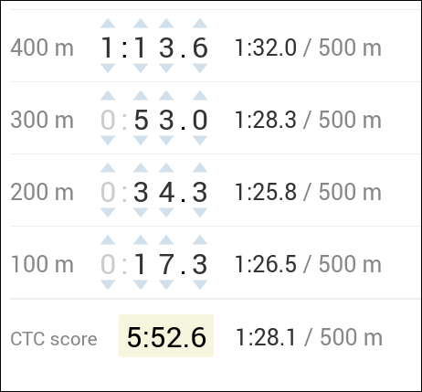

# CTC helper, August 2016

## Score calculator for the August 2016 challenge on c2ctc.com

This page was made as an aid to calculating scores for the [August 2016
CTC](http://c2ctc.com/index.php?c_id=138).

The pace displayed for each interval is rounded to the nearest tenth of
a second, as is the final score. The paces are not rounded internally,
which means that the displayed paces may not add up exactly to the
final score. However, it also means that the final score is as precise
as possible.

